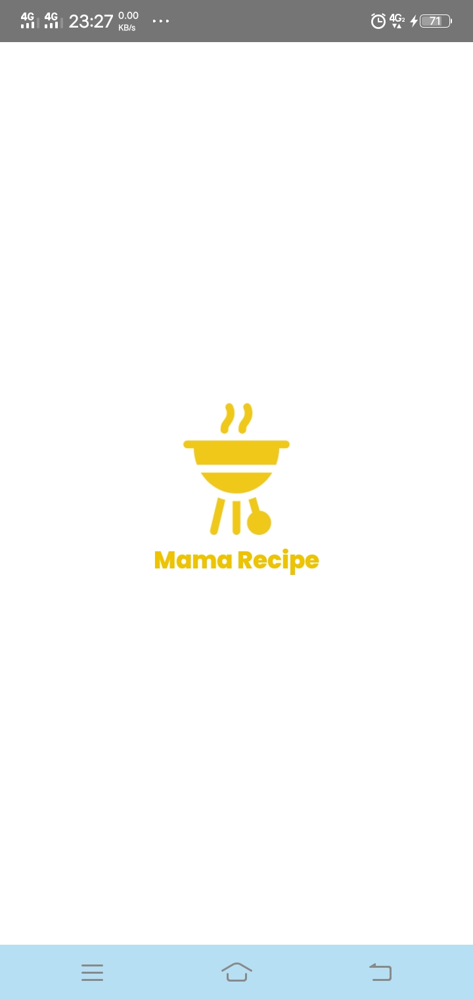
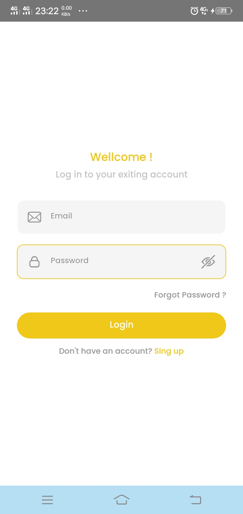
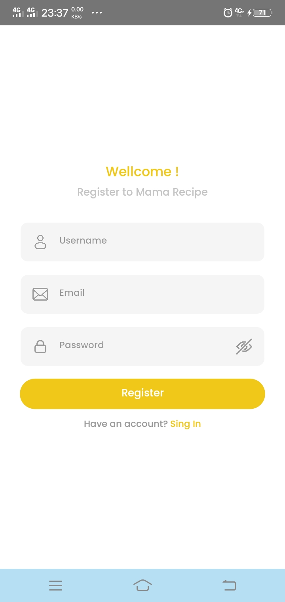
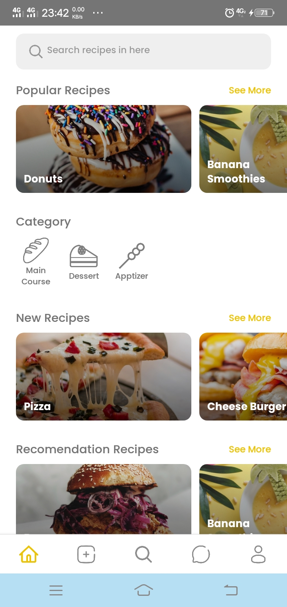
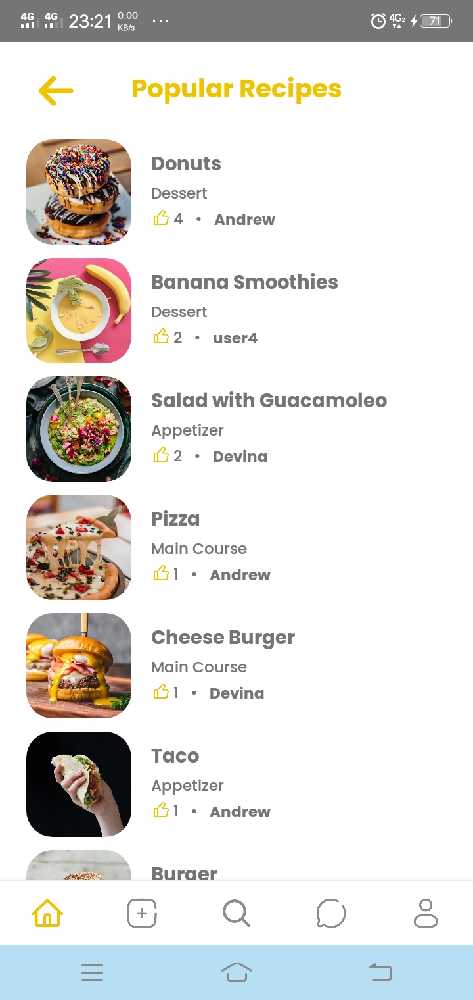
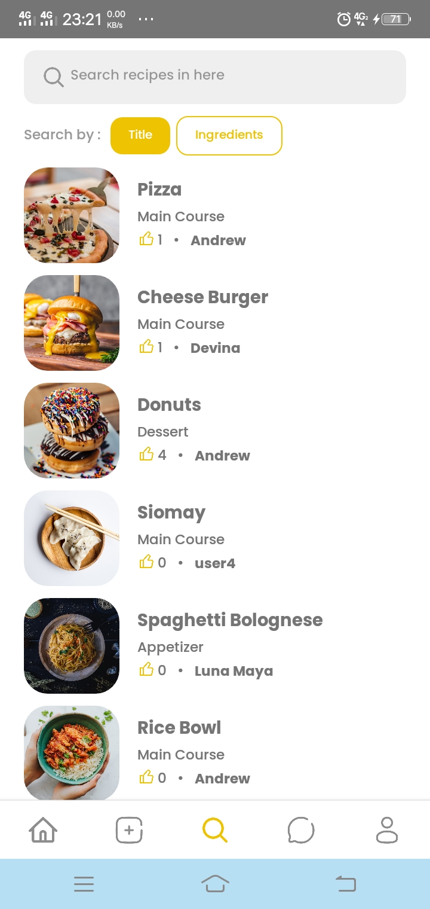
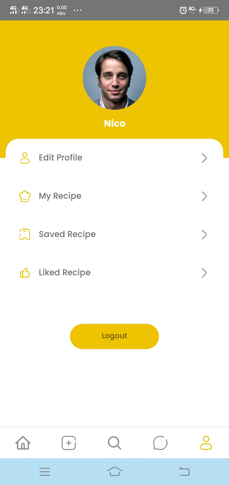
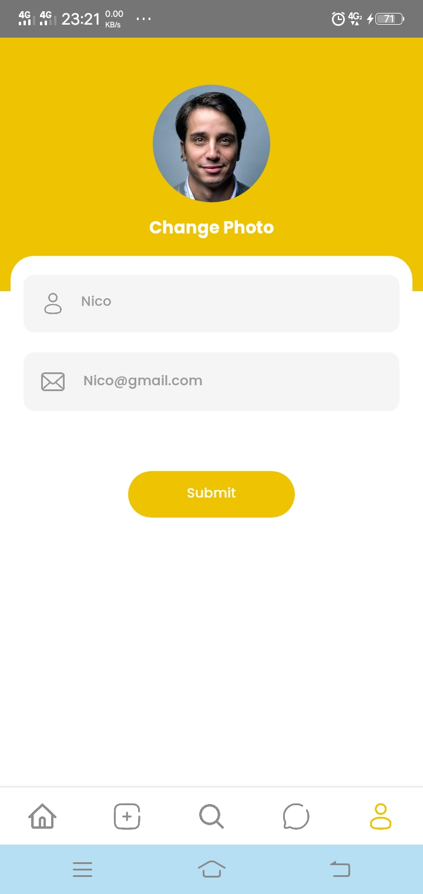
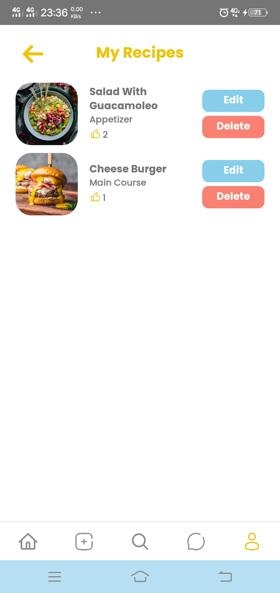
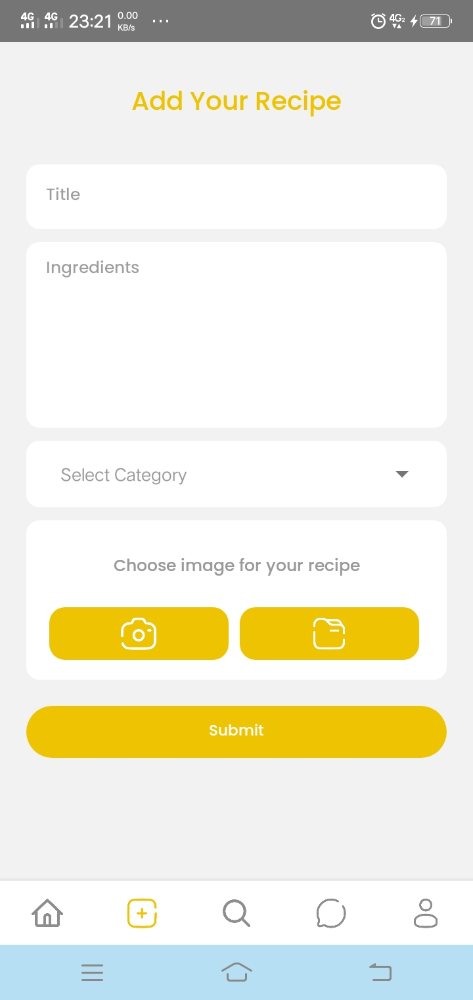

<h1 align="center">Welcome to Mama Recipe Mobile 👋</h1>

> Mama Recipe Mobile is a mobile application that serves as a source of captivating food recipes. Within this app, users can discover delectable recipes shared by others and also contribute their own culinary creations. Mama Recipe Mobile is meticulously crafted using React Native technology, ensuring a seamless and engaging culinary experience for all.

### ✨ Demo : [Link download apk](https://drive.google.com/file/d/1_UpJDTweJPkj1J9Xd6OxKIxOJWSf5KCG/view?usp=drive_link)

## 🧑 User Acount
You can use your active email account to register, but if you experience problems during registration such as not getting the verification link then use this tester account
```
email : Nico@gmail.com
password: Nico
```

## 🛠 Build with
This app was built with some technologies below:
* React Native
* Javascript
* Axios
* Redux
* CSS

## 🔥 Getting Started
Before going to the installation stage there are some software that must be installed first
* Node JS
* JDK
* Android Studio

### Back-end
The back end of this project is a REST-API created in Express JS. You can find it [here](https://github.com/AryaJulianda/RECIPE-BE)

### Environtment
Create .env file in your root project folder
```
BASE_URL=(base url or back-end url)
```

### Install

```
npm install
```

### Usage
To start on android :
```
npm run android
```


## 📸 Screen Shoot

<h3>Splash Screen</h3>

<h3>Login</h3>

<h3>Register</h3>

<h3>Home Screen</h3>

<h3>Popular</h3>

<h3>Search Recipe</h3>

<h3>Profile</h3>

<h3>Edit Profille</h3>

<h3>My Recipes</h3>

<h3>Add Recipe</h3>


<!-- CONTRIBUTING -->
### 🍻 Contributing

Contributions are what make the open source community such an amazing place to be learn, inspire, and create. Any contributions you make are **greatly appreciated**.

1. Fork the Project
2. Create your Feature Branch (`git checkout -b your/branch`)
3. Commit your Changes (`git commit -m 'Add some AmazingFeature'`)
4. Push to the Branch (`git push origin feature/yourbranch`)
5. Open a Pull Request


<!-- RELATED PROJECT -->
### 🚀 Related Project
* [`Mama Recipe BE`](https://github.com/AryaJulianda/RECIPE-BE)


### 🤖 Author

 **Arya Julianda**

* Github: [@AryaJulianda](https://github.com/AryaJulianda)
* LinkedIn: [@Arya Julianda](https://www.linkedin.com/in/aryajulianda)

### Show your support

Give a ⭐️ if this project helped you!

***
Made by ❤️ 
